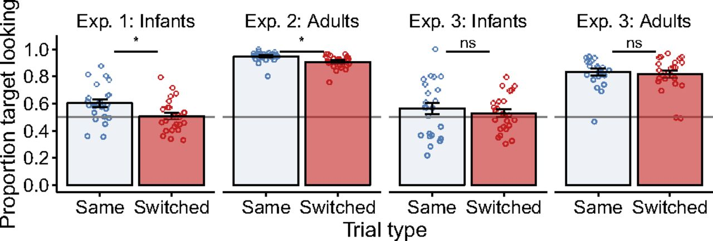
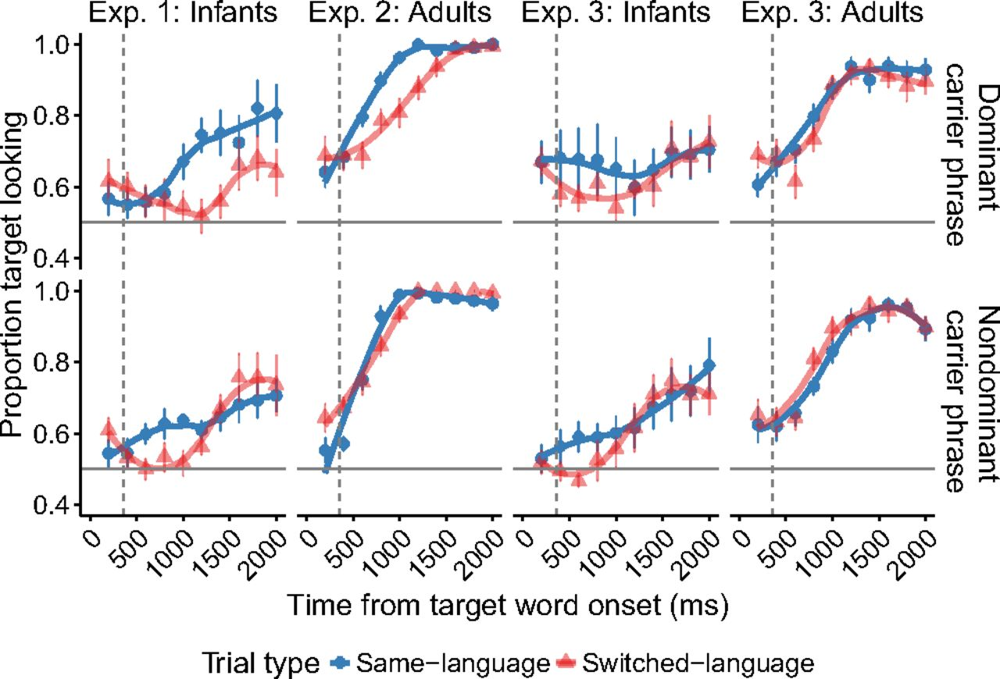

## Aim

The goal of this RMarkdown file is to recreate the Figures 2 and 3 from a recent article on bilingual infant language processing:

Byers‐Heinlein, K., Morin‐Lessard, E., & Lew‐Williams, C. (2017).
Bilingual infants control their languages as they listen. *Proceedings
of the National Academy of Sciences, 114*(34), 9032–9037. https://doi.org/10.1073/pnas.1703220114

Specifically, we are interested in Figures 2 and 3 in the PNAS article.

All analyses are using the data and scripts for processing the data made publicly available at the article's accompanying OSF page: https://osf.io/htn9j/

### Motivating Observation

The main observation motivating the current re-analysis effort is that Figure 2 - showing average accuracy in looking to the target object in Exps 1-3 - and Figure 3 - showing the timecourse of participants' looking to the target object in Exps 1-3 - do not appear to line up well, despite plotting the same underlying data (at least based on my understanding of the papers' methods).





This is not necessarily obvious in all panels, especially since the data is split up by an additional factor (dominant vs. non-dominant carrier phrase language) in Figure 3. However, one place where this jumps out to my eye is if you look at the switched-language condition in Experiment 1 (red line). 

* in Figure 2, overall average looking in the switched condition is M = 0.51.
* in Figure 3, however, looking appears to be ~10% higher than this on average, and the curve consistently sits well above 50% for the majority  of the target window.
* The mean target looking for the dominant language block in the switched condition is reported as M=0.48 in the main body of the text (p.9033). However, the target looking never dips below 0.5 in Figure 3 for this block/condition combination.

Similarly, in all of the conditions of the infant experiments (Exps 1 and 3) target looking in the timecourse plot appears to my eye to suggest a 5-10% higher accuracy than what is shown in Fig 2 (and reported as overall average looking accuracy in the main body of the paper).

Therefore, I tried to recreate both figures based on the publicly availbale data and scripts. As far as I can tell, the scripts accompanying the paper provide code for conducting all analyses, but not for generating the figures. The scripts below attempt to match the figures shown in the paper, using the same pre-processing steps taken in the analysis scripts. In the case of Figure 2, this is pretty straightforward. In the case of Figure 3, this is not 100% obvious to me, because I'm not sure from the figure caption e.g. how the data was binned and summarized, but I show a few different approaches below.

## Recreating Figure  2

### Loading and preparing the data

This part of the code  uses the code and dataset from the OSF website for the paper (https://osf.io/htn9j/) to set up the data frame. The code is essentially copied from the R file "switching_analysis.R".

```{r,message=F}
## load libraries
library(eyetrackingR)
library(tidyverse)
library(cowplot) #include this package for some nice default aesthetics
theme_set(theme_cowplot())
library(here)
library(knitr)

## load data
mydata<- read.csv(here("data","switching_data.csv"))


## Creates initial dataframe
data <- make_eyetrackingr_data(mydata,
                               participant_column = "id",
                               trial_column = "trial.number.unique",
                               time_column = "TrialTimestamp",
                               trackloss_column = "trackloss",
                               aoi_columns = c('look.target', 'look.distractor'),
                               treat_non_aoi_looks_as_missing = TRUE)
```


### PNAS Figure 2: Average Looking Accuracy

First, our goal is to reproduce Figure 2 from the paper.

We use the code from switching_analysis.R to produce aggregate by-subject accuracy across the response window. The code below is directly copied from switching_analysis.R.

```{r, message=F}
### Accuracy

## Creates dataframe that is only data within window of analysis, 360ms after noun onset (which occurs at 5400ms)
response_window <- subset_by_window(data, 
                                    window_start_time = 5760, #360ms after noun onset
                                    window_end_time = 7400, #2000ms after noun onset
                                    rezero = FALSE)


## Gets rid of rows with trackloss within window of analysis
response_window_clean <- clean_by_trackloss(data = response_window,
                                            trial_prop_thresh = (1 - 750/(2000-360))) # Need at least 750ms looking = 750/(2000-360)

## Aggregate by subject across response window
response_window_agg_by_sub <- make_time_window_data(response_window_clean, 
                                                    aois = "look.target",
                                                    predictor_columns=c("trial.type", "age.group", "switch.type", "per.dom", "per.nondom", "lang.mix"),
                                                    summarize_by = "id",
                                                    other_dv_columns = c("PupilLeft", "PupilRight"))
```

Note that we obtain the same main overall results, with the same t-values reported in the paper.

```{r}
## t-tests: Accuracy by carrier type on same-language vs. switched-language trials
response_window_agg_by_sub %>%
  group_by(switch.type, age.group) %>%
  do(broom::tidy(t.test(.$Prop ~ .$trial.type, data = ., paired = TRUE))) %>%
  mutate(cohen_d = statistic/sqrt(parameter +1)) %>%
  select(-estimate) %>%
  kable()
```

Now, we compute means and SEs as in switching_analysis.R to reproduce the graph from Figure 2. Since the code for creating the graphs is to my knowledge not included on the OSF page, I did my best to roughly reproduce the aesthetics from the original paper.

```{r, fig.width=12,fig.height=4}
#add parameter Exp to track experiment names from paper
response_window_agg_by_sub <- unite(response_window_agg_by_sub, exp, switch.type,age.group, remove=FALSE) %>%
  mutate(exp=recode_factor(exp, 
       "Within-sentence_20-month-olds" = "Exp 1: Infants", 
       "Within-sentence_Adults" = "Exp 2: Adults",
       "Across-sentence_20-month-olds" = "Exp 3: Infants",
       "Across-sentence_Adults" = "Exp 3: Adults"))

## Means and SDs by trial type, stored in the data frame mean_df
mean_df <- response_window_agg_by_sub %>% # Get all the means
  group_by(switch.type, age.group, trial.type,exp) %>%
  summarise(target.mean = mean(Prop), target.sd = sd(Prop), n = length(unique(id)))

#plot
ggplot(mean_df,aes(trial.type,target.mean,fill=trial.type,color=trial.type))+
  geom_bar(stat="identity",color="black",size=1.2,alpha=0.3)+
  scale_fill_brewer(direction=-1,palette="Set1")+
  scale_color_brewer(direction=-1,palette="Set1")+
  geom_jitter(data=response_window_agg_by_sub,aes(y=Prop),width=0.1,shape=21,fill=NA,size=2)+
  geom_errorbar(aes(ymin=target.mean-target.sd/sqrt(n),ymax=target.mean+target.sd/sqrt(n)),width=0.2,color="black")+
  geom_hline(yintercept=0.5,linetype="solid")+
  xlab("Trial type")+
  ylab("Proportion target looking")+
  theme(legend.position="none",text = element_text(size=24),axis.text.x = element_text(size=20),axis.text.y = element_text(size=20))+
  scale_y_continuous(breaks=c(0,0.2,0.4,0.6,0.8,1.0))+
  facet_grid(~exp)
```

This figure reproduces basically the identical accuracy plot from the PNAS paper below.


## Recreating Figure 3

### Timecourse plot (200ms timebins)

Next, I attempted to use exactly the same data to recreate the timecourse of looking to target across the response window (Figure 3 in the paper).

There are a few different ways that one could approach the aggregation process. The plot below uses the following approach:

1. Bin the data into 200ms timebins (which appears to have been done to create the mean points every 200 ms in Figure 3)

2. Aggregate looking data within each subject

3. Aggregate the resulting average looking data for each subject across all subjects

Steps 2 and 3 follow the typical approach in our lab (though we would typically not aggregate the data in timebins) and should in theory match up well with the average bar plots from Figure 2, but other approaches are possible. My general impression from exploring a few different aggregation techniques is that the resulting curves look similar regardless of aggregation technique. 


```{r, message=F, warning=F}
#bin the data into 200ms time bins (apparent approach in PNAS Figure 3)
response_window <- response_window %>%
  mutate(TimeBin200 = round(response_window$TrialTimestamp/200,0),
         TimeBin200Ms = TimeBin200*200,
         TimeBin200Ms_Noun = TimeBin200Ms - 5400)

## Gets rid of rows with trackloss within window of analysis (same as above)
response_window_clean <- clean_by_trackloss(data = response_window,
                                            trial_prop_thresh = (1 - 750/(2000-360))) # Need at least 750ms looking = 750/(2000-360)

#summarize data first within each subject
response_window_timecourse_by_sub_200ms <- response_window_clean %>%
  group_by(switch.type,age.group,id,trial.type,Carrier,TimeBin200Ms,TimeBin200Ms_Noun) %>%
  summarize(acc = mean(look.target,na.rm=T))

#summarize data across subjects
response_window_timecourse_across_sub_200ms <- response_window_timecourse_by_sub_200ms %>%
  group_by(switch.type,age.group,trial.type,Carrier,TimeBin200Ms,TimeBin200Ms_Noun) %>%
  summarize(mean.target = mean(acc,na.rm=T),se.target = sd(acc)/sqrt(length(acc)))

#add parameter Exp to track experiment names from paper
response_window_timecourse_across_sub_200ms <- 
  unite(response_window_timecourse_across_sub_200ms, exp, switch.type,age.group, remove=FALSE) 
response_window_timecourse_across_sub_200ms$exp <- as.factor(response_window_timecourse_across_sub_200ms$exp)
response_window_timecourse_across_sub_200ms <- response_window_timecourse_across_sub_200ms %>%  mutate(exp=recode_factor(exp, 
       "Within-sentence_20-month-olds" = "Exp 1: Infants", 
       "Within-sentence_Adults" = "Exp 2: Adults",
       "Across-sentence_20-month-olds" = "Exp 3: Infants",
       "Across-sentence_Adults" = "Exp 3: Adults"))
```

However, when I attempt to use exactly the same data to show the timecourse of looking to target across the response window, the resulting figure shows discrepancies from PNAS Figure 3.

```{r, message=F, fig.width=11,fig.height=5,warning=F}
ggplot(filter(response_window_timecourse_across_sub_200ms,!is.na(Carrier)),aes(TimeBin200Ms_Noun,mean.target,color=trial.type))+
  geom_smooth(se=F,size=2)+
  geom_point(aes(shape=trial.type),size=4,alpha=0.5)+
  geom_errorbar(aes(ymin=mean.target-se.target,ymax=mean.target+se.target),width=0)+
  geom_vline(xintercept=360,linetype="dashed")+
  geom_hline(yintercept=0.5,linetype="solid")+
  xlim(0,2000)+
  xlab("Time from target word onset (ms)")+
  scale_color_brewer(direction=-1,palette="Set1")+
  theme(legend.position=c(0.05,0.9))+
  facet_grid(Carrier~exp)
```


The most notable difference is that average looking during switch trials virtually never dips below 50% in the infant experiments in the PNAS Figure 3, but dips well below 50% for a substantial period of the looking window in the graphs I generate.  The latter pattern, with switch trial looking moving from below 50% to above 50%, is more consistent with overall average looking of close to 50% in both infant experiments in Figure 2. For example, if we focus on the switched condition in Exp 1, the timecourse plot I re-generated dips below 50% in several places and in general looks more like about what I'd expect if average looking accuracy is 51% overall.

There are also a few other things I find puzzling. For example, to my eye, the graph I generated for Exp 2 with adults actually looks quite similar to that same panel in the PNAS Fig 3. This makes the differences in the other panels even more striking in my mind, since as far as I can tell, I am handling the data in exactly the same way.

### Timecourse plot (60 Hz)

Just to make sure nothing too funky happened in the binning step, I also re-plotted Figure 2 without binning the data into 200 ms timebins, instead retaining the data at a sampling rate of 60 Hz (i.e. samples every 16-17ms).


```{r, message=F, fig.width=11,fig.height=5,warning=F}
## Gets rid of rows with trackloss within window of analysis (same as above)
response_window_clean <- clean_by_trackloss(data = response_window,
                                            trial_prop_thresh = (1 - 750/(2000-360))) # Need at least 750ms looking = 750/(2000-360)

sample_rate <- 1000/60
response_window_clean <- response_window_clean %>%
  mutate(TimeBin16 = round(response_window_clean$TrialTimestamp/sample_rate,0)*sample_rate,
         TimeBin16_Noun = TimeBin16 - 5400)

bySub <- response_window_clean %>%
  group_by(switch.type,age.group,id,trial.type,Carrier,TimeBin16_Noun) %>%
  summarize(N = sum(!is.na(look.target)),Accuracy = mean(look.target,na.rm=TRUE))

byGroup <- bySub %>%
  group_by(TimeBin16_Noun,switch.type,age.group,trial.type,Carrier) %>%
  summarize(N = sum(!is.na(Accuracy)),
            SD = sd(Accuracy,na.rm=TRUE),
            SE = SD/sqrt(N),
            Accuracy = mean(Accuracy,na.rm=TRUE),
            lower = Accuracy - SE,
            upper = Accuracy + SE)

#add parameter Exp to track experiment names from paper
byGroup <- unite(byGroup, exp, switch.type,age.group, remove=FALSE)
byGroup$exp <- as.factor(byGroup$exp)
byGroup <- byGroup %>%
  mutate(exp=recode_factor(exp, 
       "Within-sentence_20-month-olds" = "Exp 1: Infants", 
       "Within-sentence_Adults" = "Exp 2: Adults",
       "Across-sentence_20-month-olds" = "Exp 3: Infants",
       "Across-sentence_Adults" = "Exp 3: Adults"))


ggplot(filter(byGroup, !is.na(Carrier)), aes(x=TimeBin16_Noun, y=Accuracy, fill=trial.type, color=trial.type)) + 
  geom_line() +
  geom_smooth(aes(ymin=lower, ymax=upper), stat="identity") +
  geom_vline(xintercept=360,linetype="dashed")+
  geom_hline(yintercept=0.5,linetype="solid")+
  scale_color_brewer(direction=-1,palette="Set1")+
  scale_fill_brewer(direction=-1,palette="Set1")+
  labs(x='Time since target onset (in ms)',y='Proportion Looking to Target') +
  theme(legend.position=c(0.05,0.9))+
  facet_grid(Carrier~exp)

```

Given that I doubt that there should be large differences for different aggregation techniques, and since e.g. my graph for Exp 2 with adults looks very similar to my eye to that panel in PNAS Figure 3, I'm wondering what might be causing these discrepancies (both between the overall average looking time in Figure 2 and the timecourse plots in Figure 3 in the PNAS paper and between the graphs I generated and Figure 3).
